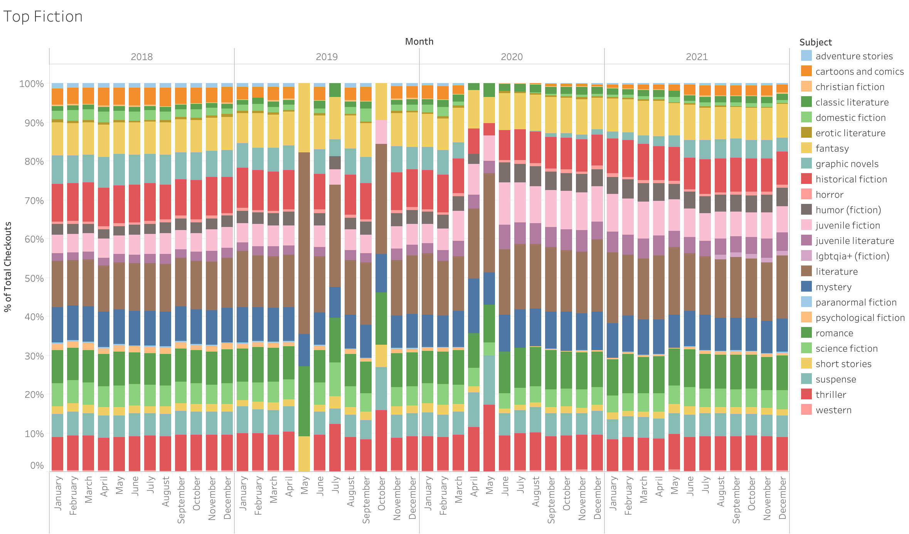
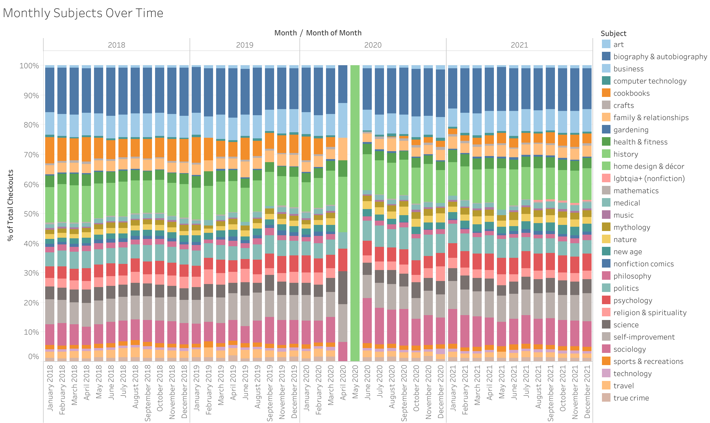
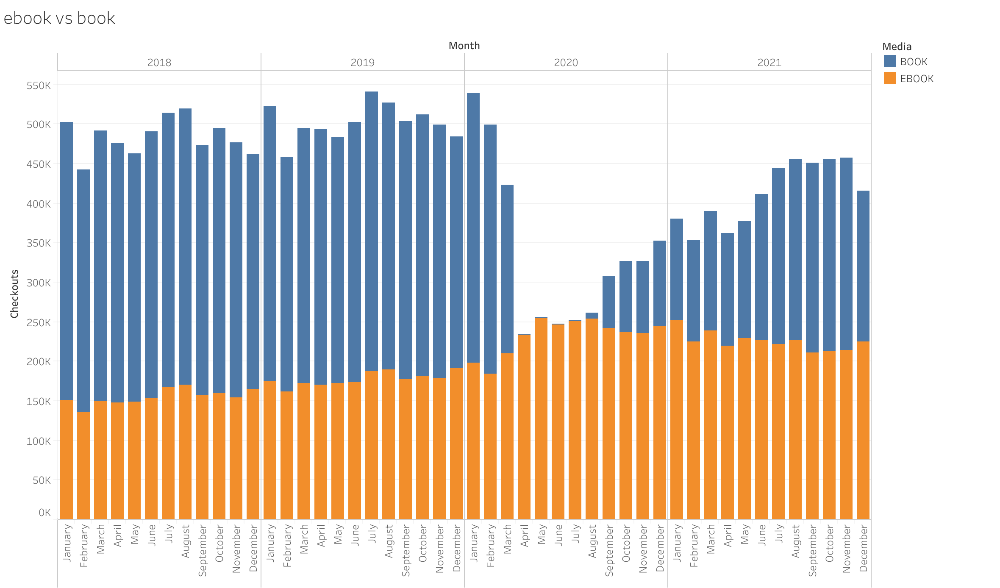
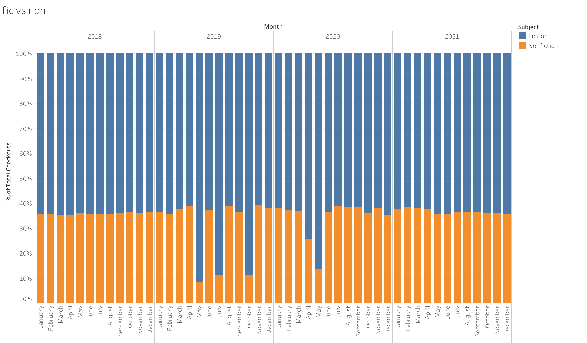
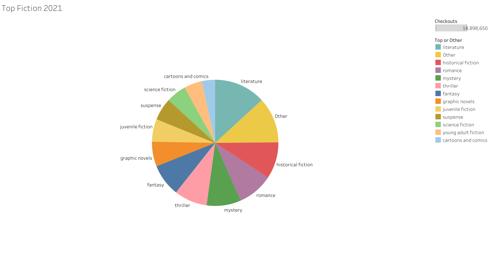
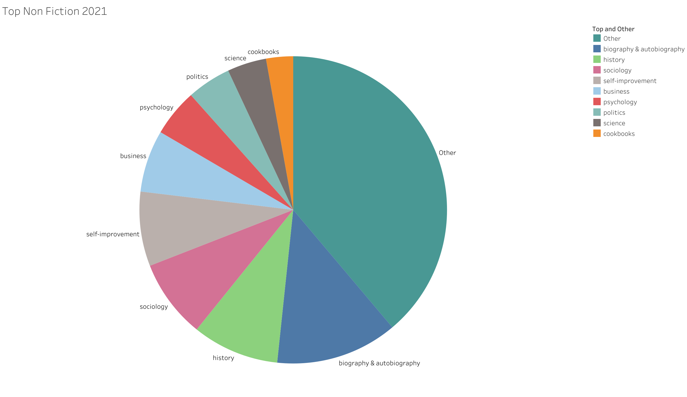

## Seattle Library Subject Traffic Case Study

Using the Seattle Public Library's data set available via the Seattle government website, I want to learn how reader interests have shifted during the pandemic. This information could help indie publishers, writers, and large publishing houses to choose where they should focus their efforts in the near future.

The data consists of rows, each containing the number of times every items has been checked out each month. It also includes the subjects pertaining to that item.

# Issues in dealing with this the data

This dataset is particularly large and goes all the way back to 2005. To make the data more accessible, I decided to only keep data from up to two years before the start of the pandemic.

Also, the subjects were not uniformly entered. There are many books where the subjects are only space separated rather than comma separated, plus capitalization is not consistent. Since the subjects are initially stored as a comma separated list on each item, it was computer intensive to change the data from aggregation on library item to aggregation on subject. I was able to handle most of the data transformation using sql, but the final step of populating the many-to-many connection table between library item and subject was too much for a SQL script to handle, even after letting run for over 24 hours. So, instead I wrote a python script to create these in batches and keep track of how far it has gone. The python script took over four days to finish running in batches.

# Analysis!

Once I transformed the data into my new schema, I was able to run queries to anaylze the poplarity of subjects month by month going back four years. And the big discovery is that, really, there has been no change in reading patterns of the Seattle Public Library patrons. Fiction subjects/genres, like romance, science fiction, fantasy, and historcal fiction, are largely the same as before. Also Non-Fiction subjects, like Biography, Cookbooks, History, and Self-Help, are also largely the same. Though, there does seem to be a slight increase in circulation of graphic novels as well as a growing circulation of LGBTQIA+ items.

# Graphs!

Here are some of the graphs I put together from my analysis.
Let's start with the comparison, month over month, of fiction genres going back four years:

And also for Non-Fiction Subjects:

It is also interesting to look at the rise of ebook circulation since the pandemic:

As well as fiction circulation vs non-fiction:

Here is also a representation of what subjects/genres make up the majority of circulation:

# Closing Thoughts

I learned a ton taking on this project about processing large amounts of data as well as honed my SQL and Python skills. If I were to take this on again there are a couple things I would do differently. For instance, I would lowercase all of the subjects as I insert them into their own table to help reduce the number of unique subjects. I'd also attempt to do some more fine grained data analysis to try and see if there are any subjects that have grown exponentially, but are just hidden in the current analysis due to the top subjects/genres.